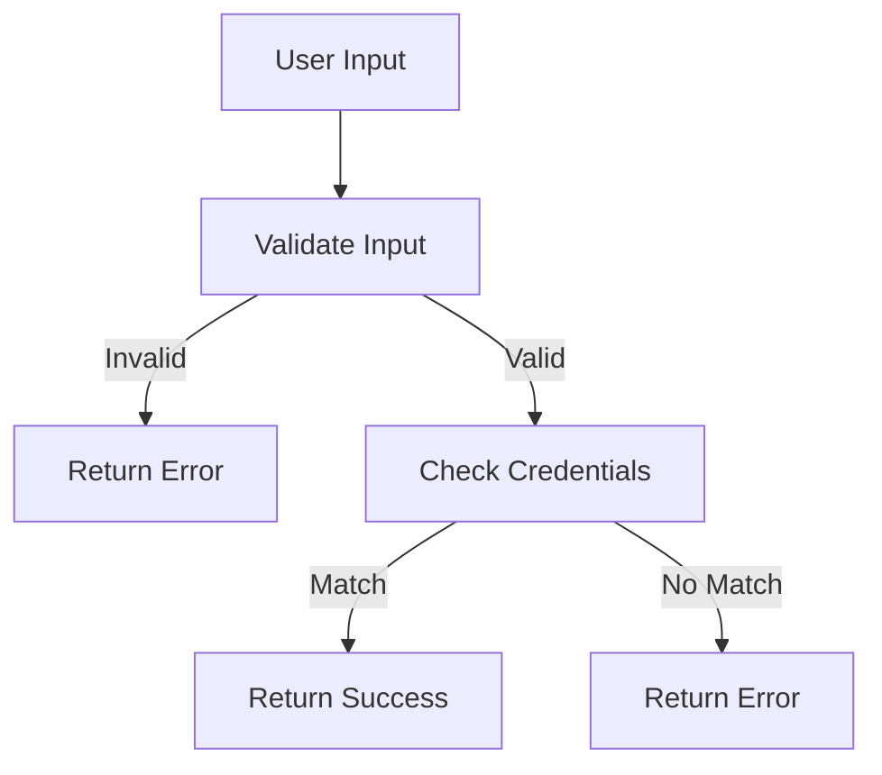

# Login Flow

```mermaid
flowchart TD
    A[User Input] --> B[Validate Input]
    B -->|Invalid| C[Return Error]
    B -->|Valid| D[Check Credentials]
    D -->|Match| E[Return Success]
    D -->|No Match| F[Return Error]
```
